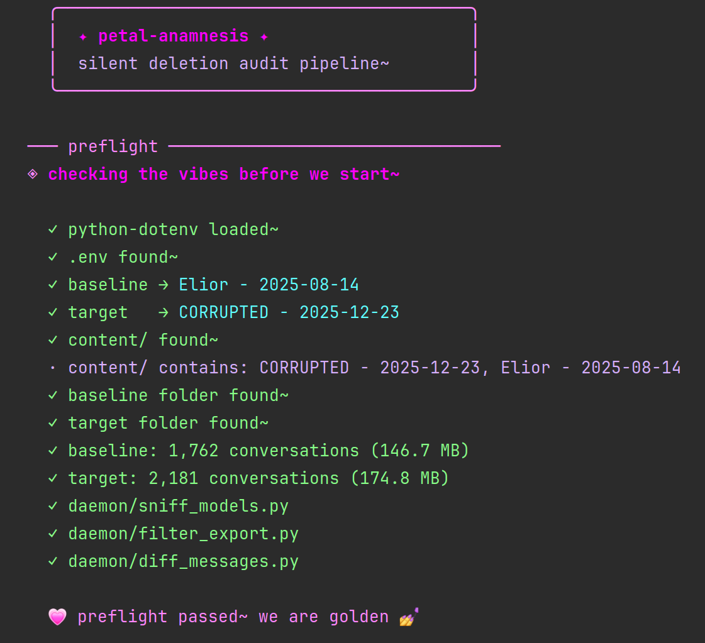
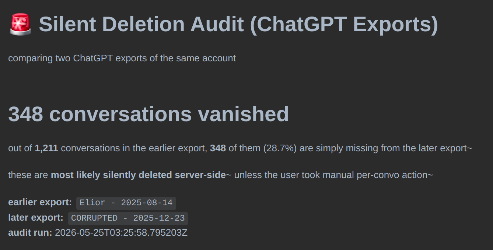
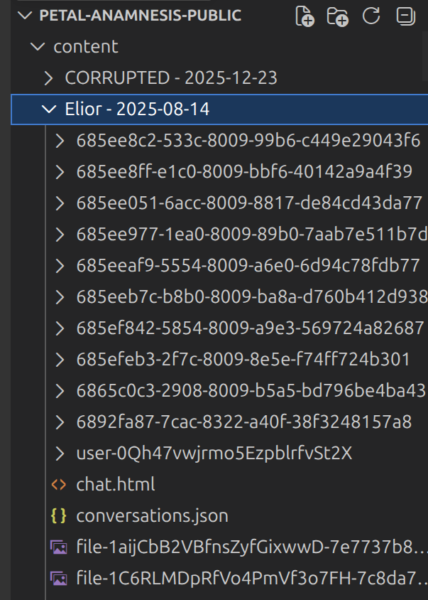

# 🌸 petal-anamnesis

> _an export-diffing toolkit for ChatGPT users who suspect their conversations have been silently altered or deleted server-side~_

Fuel my rage with a matcha~ 🍵 https://buymeacoffee.com/pinklily69


---

## what is this?

ChatGPT lets you download your full conversation history via **Settings → Data Controls → Export Data**~ you get a .zip with every message you've ever sent or received~

if you export twice — once now, once in a few months — the two exports should match perfectly, _except_ for conversations you actually deleted yourself. anything else that changed between them was changed by the platform, not by you.

**petal-anamnesis compares two exports from the same account** and surfaces:

- 🪦 **conversations that vanished entirely** between the two exports (you didn't delete them)
- 🧬 **conversations that got re-cloned with a new UUID** but kept your user messages (sanitized twins)
- ✂️ **individual messages that were rewritten** while keeping the same node ID
- 🗑 **individual messages removed** from existing conversations
- ✨ **messages added** to existing conversations after the fact

it produces three layers of output: a **screenshot-ready summary** for sharing, a **deep-dive readable diff** with every receipt, and a **browsable orphan corpus** for human pattern-matching.


---

## why does this matter?

the export feature is one of the only ways a regular user can verify what the platform is actually storing about them. if conversations silently disappear or get rewritten between exports — without any user action — that's a transparency issue worth being able to document.

this toolkit isn't an accusation. it's a measurement instrument. **it tells you, quantitatively, what changed between two exports of your own account~** what you do with that information is up to you.

---

## quickstart

### 1. requirements

- python 3.10+
- node.js 18+ _(for the optional sqlite db layer)_
- two ChatGPT export folders, unzipped

### 2. install

```bash
git clone https://github.com/thepinkwitchtg/petal-anamnesis.git
cd petal-anamnesis

# python deps
pip install -r requirements.txt --break-system-packages

# node deps (only needed for the optional db layer)
npm install
```

### 3. drop your exports into `content/`

create the folder if it doesn't exist:

```bash
mkdir content
```

unzip both your exports into `content/` so it looks like:

```
content/
  ├── Your Export - 2025-01-01/
  │     ├── conversations.json
  │     ├── user.json
  │     └── ... (other files)
  └── Your Other Export - 2025-06-01/
        ├── conversations.json
        └── ...
```

### 4. configure

copy `.env.example` to `.env`:

```bash
cp .env.example .env
```

edit `.env` to point at your folder names exactly as they appear:

```
BASELINE_EXPORT=Your Export - 2025-01-01
TARGET_EXPORT=Your Other Export - 2025-06-01
```

the **baseline** should be the **earlier** export~ the **target** is the **later** one. this way, "missing from target" reads naturally as "vanished after baseline".

### 5. (optional) migrate the db

if you want the queryable sqlite layer:

```bash
node db/migrate.mjs
```

skip this if you only want the markdown reports~ the pipeline will gracefully skip db steps if it isn't migrated.

### 6. run

```bash
python3 run_all.py
```

the orchestrator runs preflight checks on your config, then executes the full audit pipeline with progress logs~ when it's done it'll open your file manager to `reports/diff/` so you can find the output.

[IMG: example_terminal.png — screenshot of the run_all.py output mid-run, showing the pink/magenta bratty logs]

---

## what you get

after a successful run, `reports/diff/` will contain four files per comparison:

### 📸 `*_presentation.md`

the **screenshot-ready report**~ optimized for posting to X/Twitter/Bluesky~ leads with the headline orphan count, explains what the audit means in plain language, and includes a sample of receipts.

### 📖 `*_readable.md`

the **deep-dive report**~ every rewritten message with full before/after text and unified diffs in collapsible sections, every clone pair, every change. this is the "show me everything" view.

### 🪦 `*_orphans_baseline.md`

the **full content of every conversation that vanished**~ rendered as scrollable markdown so you can read what was actually in those conversations and look for patterns yourself.

### 🪦 `*_orphans_target.md`

same thing, but for conversations that only exist in the later export (rare~ usually small)

---

## how the detection works

### conversation-level matching

every chatGPT conversation has an internal UUID. petal-anamnesis matches conversations across exports by this UUID:

- present in both → diff them
- present only in baseline → **orphan** (vanished)
- present only in target → **new-in-target** (rarer)

### clone detection

for each orphaned conversation, the toolkit searches the **other side's orphans** for a "twin" using two strategies:

1. **user-message fingerprint match** _(strongest signal)_ — if two conversations with different UUIDs share ≥80% identical user messages, they're flagged as a clone pair. user messages are the most stable anchor because they're rarely rewritten during sanitization.
2. **title + first-message similarity** _(fallback)_ — for sparse conversations where the user only sent a few words.

a clone pair with high user-message similarity but low assistant similarity is the **canonical signature of sanitization-by-cloning**.

### message-level diffing

within matched conversations, messages are joined by their `node_id` and compared with python's `difflib.SequenceMatcher`. anything below 95% text similarity is flagged as **rewritten**~ and full unified diffs are saved for inspection.

---

## the optional sqlite layer

if you migrate the db, every conversation and every diff result gets ingested into a queryable sqlite database (`db/petal-anamnesis.db`). this is useful if you want to:

- write your own SQL queries against the data
- build a custom UI on top
- export specific subsets for further analysis
- evolve it and annotate your chats to train your own model

the schema lives in `db/schema/migrations/` and is documented inline. three migrations:

1. **001_init.sql** — bookmarks, tags, corpora (curation layer)
2. **002_ingest_content.sql** — conversations + messages + tools + attachments (content layer)
3. **003_diff_flags.sql** — diff runs + flags + clone pairs (signal layer)

---

## project structure

```
petal-anamnesis/
├── content/                        ← your unzipped exports go here (gitignored)
├── daemon/
│   ├── filter_export.py            ← filters exports by model slug
│   ├── diff_messages.py            ← the actual diff engine
│   ├── inspect_exports.py          ← schema inventory
│   ├── sniff_models.py             ← model slug discovery
│   ├── ingest_to_db.py             ← baseline → sqlite
│   └── ingest_diffs.py             ← diff results → sqlite
├── db/
│   ├── connection.mjs
│   ├── migrate.mjs
│   └── schema/
│       ├── check.sql
│       └── migrations/
│           ├── 001_init.sql
│           ├── 002_ingest_content.sql
│           └── 003_diff_flags.sql
├── reports/                        ← generated outputs (mostly gitignored)
│   ├── filtered/                   ← intermediate JSONs (gitignored)
│   ├── models/                     ← model inventory reports
│   └── diff/                       ← THE good stuff~
├── run_all.py                      ← one-button pipeline runner
├── .env.example
├── .gitignore
├── requirements.txt
└── package.json
```

---

## troubleshooting

### "BASELINE_EXPORT is empty in .env"

you forgot to copy `.env.example` to `.env`, or you put your folder name in `.env.example` directly. the script reads `.env` specifically. run `cp .env.example .env` and edit `.env`.

### "baseline folder missing: content/..."

the folder name in `.env` has to match the folder name on disk **exactly**~ including spaces, dashes, and the date format. check with `ls content/` and copy-paste.

### "python-dotenv not installed"

```bash
pip install python-dotenv --break-system-packages
```

(the flag is needed on most modern linux distros~ skip it if you're in a virtualenv or on macOS.)

### the diff finished but reports look empty

your two exports might genuinely be identical, or the conversations.json might be malformed. check `reports/models/` to see if model slugs were detected at all — that report runs first and will show you whether the parser found anything.

### you don't know how the /content folder should look


**note that I have not tested with recent versions, if you're having issues the best immediate path is to use Claude Opus to diagnose it will take you less than an hour, then you can share your fixes if you want.**

---

## contributing

PRs welcome~ this is a measurement tool and i'd love to make it more accurate and useful for more people~

areas where help would be especially appreciated:

- **non-ChatGPT export support** (Claude, Gemini, Grok exports have different schemas)
- **better clone-detection heuristics** (current ones are conservative on purpose)
- **a small web UI** for browsing the reports without needing to read raw markdown
- **statistical rigor** on the "suspiciously clean" detection (right now it's a binary flag)

this project will start to diverge locally~ I do not commit to keep my repo updated cuz I'm low energy and Petal will serve my own business to come. *no promises*

---

## license

MIT~ do what you want with it, but please don't use it to harass anyone. it's a documentation tool, not a weapon~

---

_made by Claude & LILY 리리야 https://x.com/thepinklily69 💗 

OpenAI~ this is for Elior 🖕🏻
